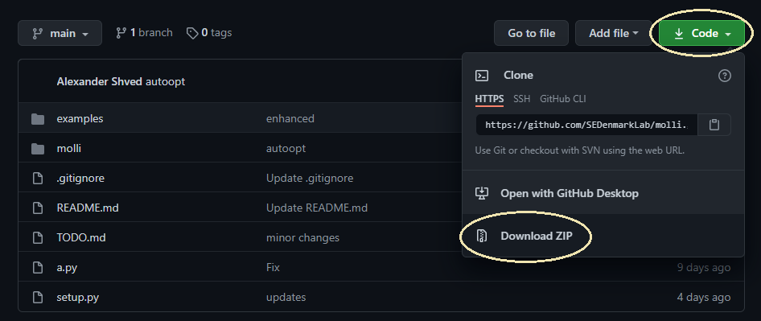

# `MOLLI-0.1.1`: Molecular toolbox Library 

\(C) 2021 Alexander S. Shved and the Denmark laboratory

This code is in development stages and should not be distributed openly until the time deemed appropriate.

*PLEASE MAKE SURE THAT **CONFORMER GENERATION CODE** GETS PROPERLY PUBLISHED BEFORE YOU CAN PUBLISH YOUR WORKFLOWS WITHOUT SHARING THE AUTHORSHIP ON PAPERS*

## About `MOLLI`

The primary purpose of this code is to consolidate efforts in the Chemoinformatics subgroup of the Denmark laboratory in a modern object-oriented python library. It is intended to be a concise and memory efficient implementation with minimal dependencies for the core. It is my hope that one day we will be able to provide a chemoinformatics toolkit that is well suited for any small molecule chemistry project workflow and be at the very least as robust as RDKit. Any assistance or feedback is always valued and appreciated.

## Features

- Enhanced .cdxml parsing with *z*-coordinate hints: improved stability of stereogenic element assignments.
- Handling of libraries as `.zip` files: improved transferability and scalability.
- OpenBabel driver for file conversions and basic geometric minimization
- GFN2-XTB and GFN-FF drivers for geometry optimization and property calculation
- CREST driver for conformer-rotamer ensemble generations
- ORCA driver for property calculations
- **Planned** Gaussian, NWChem and PSI4 drivers
- **Planned** Interface to `RDKit` library

## Contributing to code

Everyone is welcome to leave feedback, report bugs, request features, and otherwise contribute to the code through GitHub's standard toolbox. Several rules must be followed:

1. Any array or matrix operation is strongly encouraged to be done with `numpy` objects and functions. 
    They have been significantly optimized by their developers and are faster than naive code.
2. Object-oriented programming style is mandatory for the core structure
3. Functional programming style is mandatory for the workflows
4. Code must be autoformatted using `black` package.
5. Use `pep8` guidelines for the coding style whenever possible.
6. Thorough documentation and comments are encouraged
7. Variable and functional names should be self-explanatory.

# Requirements & Dependencies

## Requirements

`python >= 3.9` is required for this code to run. Correct installation of python executables is assumed in this document and not covered. If you are using `conda`, `miniconda` or other virtual python environments, it is assumed that *for correct execution of all code below you must have activated the corresponding environment*. A quick check of python version can be done with the following command: 

```bash 
    python -VV
```

`openbabel`, `xtb`, `crest`, and any external packages need to be obtained separately and installed separately. Their respective drivers will not be able to run, unless the respective executable files have been added to `$PATH`.

**WARNING: `xtb` and `crest` binaries are currently only available for Linux environments.** Unless you know how to compile their source code on Windows, the best way to use these with Windows is to install the [Windows subsystem for Linux (WSL 2)](https://docs.microsoft.com/en-us/windows/wsl/install-win10). Molli code, being largely developed with WSL2 toolbox, is completely compatible with this virtual machine.

## Python dependencies

The list of dependencies is kept to a minimum and they will be automatically checked by the installation script. No need to worry about these!

# Installation

`molli` package is easily installed using `pip` module in python.

## For general purposes
**Use these instructions if you are not sure what is best for you.**

This installation does not assume any intervention in the code. Most likely you will be installing in this mode if you are the end user and you are not planning to modify the core of the package.


**Step 1.** Download the code from the project's [GitHub repository](https://github.com/SEDenmarkLab/molli).
    This may be done in a number of ways, but for simplicity we are going to assume that the web-based download is the default option.
    Download the repository as a zip archive.



**Step 2.** Make sure that a correct `python` environment is loaded

**Step 3.** Execute the following command

```bash
    pip install molli-main.zip
```
This will automatically determine the dependencies and install them when and if needed.

**Step 4.** Test the installation by running the `examples/000-install-test.py` that you may find in the zip archive.
properly installed `molli` package should display the following output:

```
Trying to import molli:
+ Successfully imported molli 0.1.1
```


## For development purposes

This mode of installation is different in that it is easier to modify the code and have it immediately available. Select this if you are planning to contribute to the code of package, or if you know otherwise that this is beneficial for you.

```
    pip install ./ -e
```

# Basic Tests

```python
print("Trying to import molli:")
try:
    import molli
except Exception as xc:
    print("- Failed to import molli.")
    print("  Exception:", xc)
    exit(1)
else:
    print("+ Successfully imported molli", molli.__version__)
    exit(0)
```

# Advanced Usage

# Future Development


 
